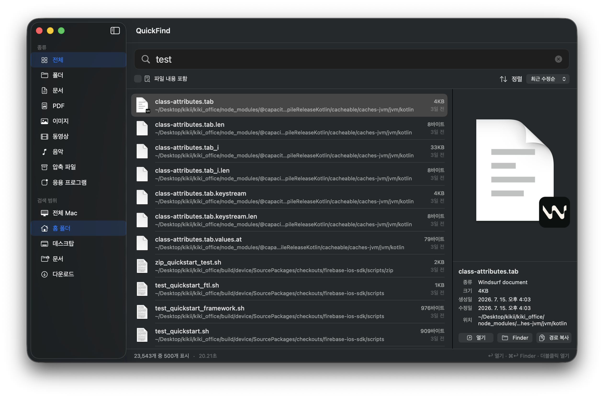
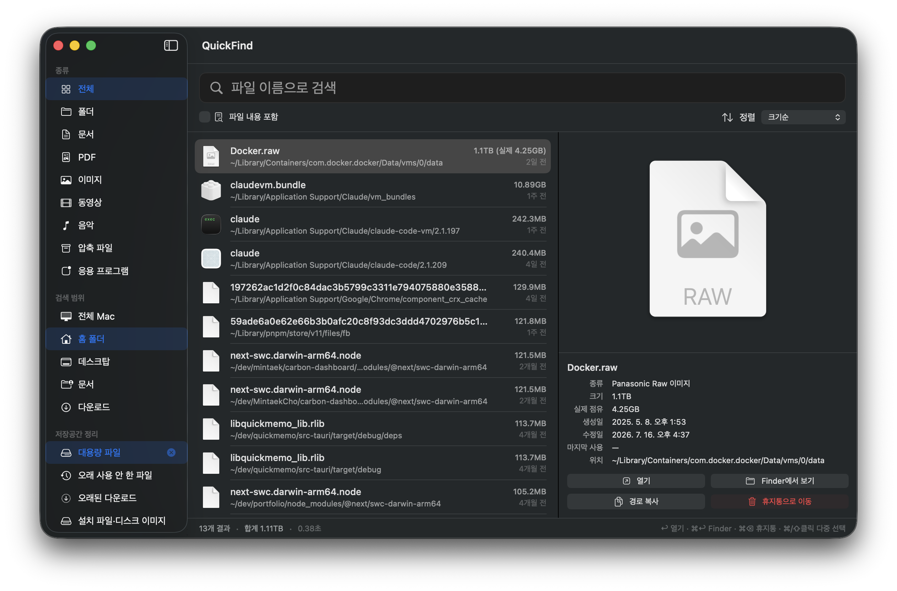

# QuickFind

**macOS를 위한 초고속 파일 검색 + 저장공간 정리 앱**

Spotlight 인덱스를 직접 조회해 타이핑하는 즉시 결과가 나타납니다. 파인더 검색이 답답했다면, 그리고 "내 디스크 어디에 뭐가 쌓여 있는지" 한눈에 보고 정리하고 싶었다면 — 그걸 하나로 해결합니다.

> Blazing-fast file search + storage cleanup for macOS, powered by the Spotlight index. Korean-first UI.



## 주요 기능

### 🔍 실시간 파일 검색
- 입력 즉시 검색 — Spotlight 인덱스 기반이라 디스크를 새로 뒤지지 않습니다 (평균 0.0x초)
- 한글·영문, 파일 이름 + **파일 내용** 검색
- 종류 필터(문서/이미지/동영상/PDF/앱 등) × 검색 범위(전체 Mac/홈/데스크탑/문서/다운로드) 조합
- Quick Look 미리보기 + 메타데이터 패널
- 키보드 완결: `↑↓` 이동 · `↩` 열기 · `⌘↩` Finder에서 보기 · `⌘F` 검색창
- 결과를 파인더·브라우저로 **드래그 앤 드롭**

### ⚡ 어디서든 호출
- **`⇧⌘Space` 전역 단축키** — 어떤 앱을 쓰다가도 즉시 검색창 호출/숨김 (접근성 권한 불필요)
- 메뉴바 우클릭 → 전역 단축키에서 `⌥Space` / `⌃⇧Space` 로 변경하거나 끌 수 있습니다
- **메뉴바 상주** — 좌클릭으로 토글, 우클릭 메뉴에서 단축키·Dock 아이콘 숨기기 설정
- 창을 닫아도 메뉴바에 남아 언제든 다시 부를 수 있습니다

### 🪟 여러 폴더 동시 검색
- **화면 분할** — 툴바 버튼으로 한 창 안에 독립 검색 패널 2개 (각자 검색어·범위·종류·정렬)
- **다중 창** — `⌘N` / 툴바 / 메뉴바 메뉴로 완전히 독립된 검색 창을 여러 개

### 🧹 저장공간 정리



- **대용량 파일** (100MB+) / **오래 사용 안 한 파일** (1년+ 미사용) / **오래된 다운로드** / **설치 파일·디스크 이미지** 프리셋
- sparse 파일은 논리 크기와 **실제 디스크 점유**를 함께 표시 (예: Docker.raw `1.1TB (실제 4.25GB)`)
- `⌘클릭`/`⇧클릭` 다중 선택, 선택 합계 용량 표시
- 휴지통 이동(`⌘⌫`) · 휴지통 보기 · 영구 삭제 · 휴지통 비우기 — 모두 확인 창을 거칩니다

## 설치

[Releases](../../releases)에서 최신 `QuickFind.zip`을 받아 압축을 풀고 `QuickFind.app`을 응용 프로그램 폴더로 옮기세요.

> **처음 실행 시**: 이 앱은 아직 Apple 공증을 받지 않아 Gatekeeper 경고가 뜹니다.
> 앱을 **우클릭 → 열기 → 열기**를 한 번 해주면 이후에는 정상 실행됩니다.
> 또는 터미널에서: `xattr -dr com.apple.quarantine /Applications/QuickFind.app`

### 권한 안내

| 권한 | 용도 | 시점 |
|---|---|---|
| 다운로드·데스크탑·문서 폴더 | 해당 폴더를 검색 결과에 포함 | 첫 실행 시 자동 프롬프트 |
| 전체 디스크 접근 (선택) | 휴지통 목록 보기, 검색 완전성 | 시스템 설정에서 수동 부여 |
| Finder 제어 (선택) | 휴지통 비우기 | 첫 사용 시 자동 프롬프트 |

## 소스에서 빌드

Xcode Command Line Tools(Swift 5.10+)만 있으면 됩니다.

```bash
git clone https://github.com/Cho-mintaek/quickfind.git
cd quickfind
./scripts/make_app.sh          # 릴리즈 빌드 + .app 번들 + 아이콘 + ad-hoc 서명
cp -R build/QuickFind.app /Applications/
```

## 기술 노트

- SwiftUI + `NSMetadataQuery`(Spotlight) + Quick Look. 외부 의존성 0
- 검색은 250ms 디바운스 후 시작, gathering 중에도 결과 스트리밍
- 휴지통은 Spotlight가 인덱싱하지 않아 직접 열거하며, 비우기는 Finder를 통해 실행
- 구현 중 만난 함정들(1개짜리 compound predicate 거부, Swift Concurrency에서 예외 삼킴, mds의 프로세스 시작 시점 TCC 캐시 등)은 커밋 히스토리와 `docs/guide.html`에 정리

자세한 사용법: [docs/guide.html](docs/guide.html)

## 로드맵

- [x] 전역 단축키 (⇧⌘Space, 변경 가능) — v1.1
- [x] 메뉴바 상주 모드 — v1.1
- [ ] 영어 로컬라이제이션
- [ ] Developer ID 서명 + 공증

## 라이선스

[MIT](LICENSE) © 2026 Cho Mintaek
